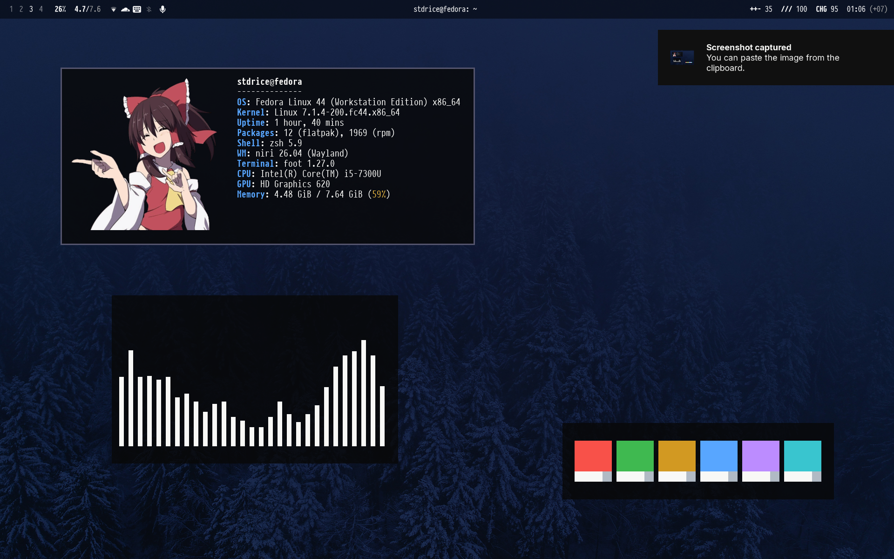

# stdrice's Linux dotfiles



# Table of Contents
- [Installation](#installation)
- [Gallery](#gallery)
- [Keybindings](#keybindings)
- [Firefox/Librewolf config](#firefox-librewolf-config)

# Installation
1. Install all dependencies

| Package | Details |
| :------ | :------ |
| `niri` | Window manager / compositor |
| `rofi`, `waybar`, `mako`, `swaybg`, `swayidle`, `swaylock` | Desktop components |
| [FiraCode](https://github.com/tonsky/FiraCode), [Inter](https://github.com/rsms/inter), [NerdFonts](https://nerdfonts.com/) | Font |
| `foot`, `zsh`, `bash` | Terminal |
| `papirus-icon-theme` | Icons |
| `brightnessctl`, `wireplumber`, `playerctl`, `gammastep`, `libnotify` | Helper |
| `dex` / `dex-autostart` | Autostart |
| `cliphist`, `udiskie`, `gnome-keyring`, `polkit-gnome`, `xdg-desktop-portal-gtk` `xdg-desktop-portal-gnome` | Daemon |
| `neovim`, `ranger`, `tmux`, `btop`, `cmus`, `calcurse`, `newsboat`, `lazygit` | Terminal software |
| `nemo`, `mpv`, `imv`, `pavucontrol`, `network-manager-applet`, `blueman` | Desktop software |
| `cava`, `fastfetch`, `imagemagick` | Terminal cosmetic |

2. Clone this repo
```
git clone https://github.com/stdrice/dotfiles
```
3. Backup all your files
4. Copy all files in `dotfiles` and paste to your `$HOME` folder
```
cp -rfT dotfiles/dotfiles $HOME/
```
5. Other setup
```
chsh -s /usr/bin/zsh
systemctl --user enable wireplumber pipewire
```

# Firefox/Librewolf config
See [firefox.md](firefox.md)
